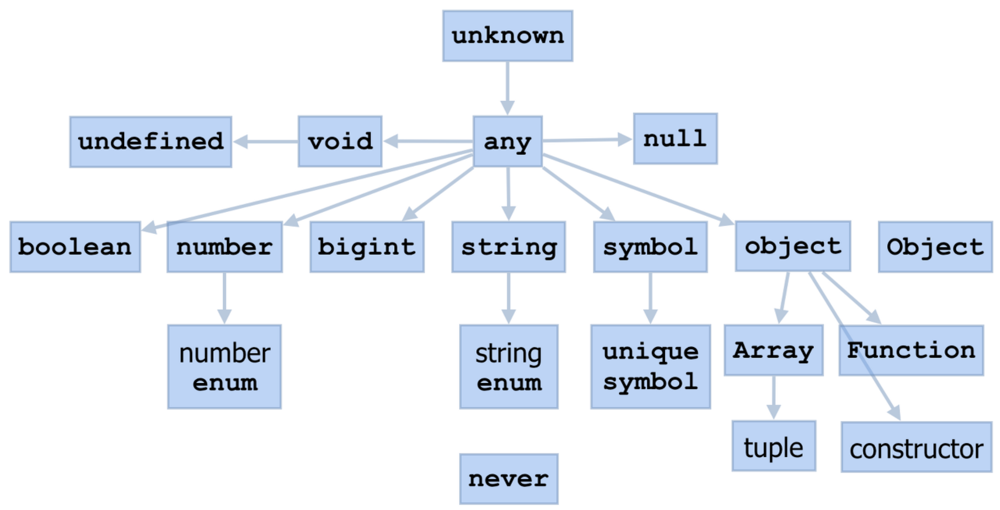

## 기본타입 7종
- null : 의도적으로 값이 없음을 나타낼 때 사용
- undefined : 변수에 값이 할당되지 않은 경우, 의도하지 않은 부재
- boolean : true, false
- string : 문자열
- number : 정수, 부동소수점, 16진수, 8진수 와 같은 숫자
- bigint : 매우큰 숫자, 123n 으로 표시
- symbol : 불변이면서 유니크한 값을 표현

### 타입 계층도

- 타입을 알 수 없는 경우에 any를 많이 사용

<br/>

## 타입 애너테이션

### 변수
- "변수명: 타입" 형식으로 변수를 선언
```typescript
const userName: string = "black";
const age: number = 25;
const isMarried: boolean = false;
```

### 함수
- 함수도 마찬가지로 "변수명: 타입" 형식으로 선언
- 반환값은 매개변수 뒤에 ": 타입" 형식으로 선언
```typescript
function printMessage(message: string): string {
    console.log(message);
    return message;
}
```

### 객체
- 객체도 동일 하지만 하나 이상의 타입을 섞어서 넣을 수 있음
```typescript
let myInfo: {
    name: string, 
    age: number, 
    isMarried: boolean
} = {
    name: "black",
    age: 25,
    isMarried: false,
}
```
### 선택적 속성
```typescript
let myInfo: {
    name: string,
    age: number,
    isMarried: boolean,
    gender?: string
} = {
    name: "black",
    age: 25,
    isMarried: false,
}
```
- 변수명 뒤에 ?를 붙여서 필수가 아닌 **선택적 속성**으로 만들 수 있음

```typescript
function printMessage(message: string, errorCode?: number): string {
    console.log(message);
    if(errorcod) {
        alert(`${errorCode} : ${message}`);
    }
    return message;
}
```
- 함수의 매개변수를 정의할 때도 사용 가능

<br/>

## 배열과 튜플