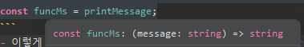

# 목차

----------------------------

### [1. 기본타입 7종](#기본타입-7종)
### [2. 타입 계층도](#타입-계층도)
### [3. 타입 애너테이션](#타입-애너테이션)
### [4. 배열과 튜플](#배열과-튜플)
### [5. any, void, never](#any-void-never)
### [6. 유니온 타입과 내로잉](#유니온-타입과-내로잉)
### [7. 타입 별칭](#타입-별칭)
### [8. 인터섹션 타입](#인터섹션-타입)
### [9. 리터럴 타입](#리터럴-타입)
### [10. 함수 타입](#함수-타입)

--------------------------------

## 기본타입 7종
- null : 의도적으로 값이 없음을 나타낼 때 사용
- undefined : 변수에 값이 할당되지 않은 경우, 의도하지 않은 부재
- boolean : true, false
- string : 문자열
- number : 정수, 부동소수점, 16진수, 8진수 와 같은 숫자
- bigint : 매우큰 숫자, 123n 으로 표시
- symbol : 불변이면서 유니크한 값을 표현

### 타입 계층도

- 타입을 알 수 없는 경우에 any를 많이 사용

<br/>

## 타입 애너테이션

### 변수
- "변수명: 타입" 형식으로 변수를 선언
```typescript
const userName: string = "black";
const age: number = 25;
const isMarried: boolean = false;
```
- 지금은 굳이 타입을 쓰지않아도 값을 선언하면 TypeScript가 자동으로 타입을 알고있음

### 함수
- 함수도 마찬가지로 "변수명: 타입" 형식으로 선언
- 반환값은 매개변수 뒤에 ": 타입" 형식으로 선언
```typescript
function printMessage(message: string): string {
    console.log(message);
    return message;
}
```

### 객체
- 객체도 동일 하지만 하나 이상의 타입을 섞어서 넣을 수 있음
```typescript
let myInfo: {
    name: string, 
    age: number, 
    isMarried: boolean
} = {
    name: "black",
    age: 25,
    isMarried: false,
}
```
### 선택적 속성
```typescript
let myInfo: {
    name: string,
    age: number,
    isMarried: boolean,
    gender?: string
} = {
    name: "black",
    age: 25,
    isMarried: false,
}
```
- 변수명 뒤에 ?를 붙여서 필수가 아닌 **선택적 속성**으로 만들 수 있음

```typescript
function printMessage(message: string, errorCode?: number): string {
    console.log(message);
    if(errorcod) {
        alert(`${errorCode} : ${message}`);
    }
    return message;
}
```
- 함수의 매개변수를 정의할 때도 사용 가능

<br/>

## 배열과 튜플
- 데이터를 여러개 넣는다는 면에서 배열과 튜플은 비슷
- 배열 => 크기가 고정이 아님
- 튜플 => 크기가 고정

### 배열
```typescript
const numbers: number[] = [1,2,3,4,5];
const numbers2: Array<number> = [1,2,3,4,5];
```
- 두 방식 다 배열을 선언하는 방법
- Array<>는 제네릭 표기법

### 튜플
```typescript
// 원소 개수만큼 타입 정의가 필요 / 고정적임
const myTuple: [string, number] = ["black", 25];

// 함수 매개변수가 여러개 일 때 유용
function printMessage(message: string, info: [string, number]): [string, number] {
    console.log(`${message}`, ...info);  // message string number 순서대로 출력
}

//결과값을 분해해서 받을 수 있음
const [name, age] = printMessage("message",["black", 25]);
```

## any, void, never
### any
- 보통 타입을 모를때 발생하는 오류를 해결(?)하기위해 any를 사용
- 비추천,,,
```typescript
let anyValue: any = 10;
anyValue = "black";
anyValue = true;
// 타입을 바꾸기가 가능하다
```

### void
- 반환값이 없을때 사용하는 타입

### never
- 의도적으로 값을 반환하지 않을 때 사용하는 타입
- 예외처리로 **오류를 반환**하거나 **무한루프**일때 사용
```typescript
// void 예제 생략

//예외처리
function throwError(message: string): never {
    throw new Error(message);
}

// 무한루프
function  infiniteLoop(): never {
    while(true){}
}
```
- ~~never은 자주 쓰지는 않을것 같다~~

## 유니온 타입과 내로잉
### 유니온 타입
- 하나의 변소를 여러가지 타입으로 지정할 수 있음
- | 기호로 타입을 구분해 여러가지 타을 정의
```typescript
let unionValue: number | string | boolean = 10; //number
unionValue = "black";   //string
unionValue = true;      // boolean
```

### 내로잉
- 타입의 범위를 좁히는 것
- 타입의 범위를 좁히는 데 사용하는 검사방법을 타입 가드라고 하며, 값 할당 또는 조건문으로 검사해 타입을 좁힘
- 조건문에서 사용할 수 있는 연산자 - typeof, instanceof, in

1. typeof
```typescript
typescript

// 기본 데이터 타입
let name: string = "John";
let age: number = 30;
let isStudent: boolean = true;
let someValue: any = null;

console.log(typeof name); // "string"
console.log(typeof age); // "number"
console.log(typeof isStudent); // "boolean"
console.log(typeof someValue); // "object"

// 함수
function greet(name: string): string {
  return `Hello, ${name}!`;
}

console.log(typeof greet); // "function"
```
2. instanceof
```typescript
class Person {
  name: string;
  age: number;

  constructor(name: string, age: number) {
    this.name = name;
    this.age = age;
  }
}

let john = new Person("John", 30);

console.log(john instanceof Person); // true
console.log(john instanceof Object); // true
console.log(john instanceof Array); // false
```
3. in
```typescript
interface Car {
  make: string;
  model: string;
  year: number;
}

let myCar: Car = {
  make: "Toyota",
  model: "Camry",
  year: 2020,
};

console.log("make" in myCar); // true
console.log("model" in myCar); // true
console.log("color" in myCar); // false
```

## 타입 별칭
- 자주 사용해야하는 유니온 타입을 타입 별칭을 사용하여 편리하게 관리
- type 키워드를 사용하여 정의
```typescript
type nsb = number | string | boolean;
```

- 내가 만든 타입에 추가로 타입을 넣어서 다시 별칭을 만드는 것도 가능
```typescript
type nullableNsb = nsb | null | undefined;
```

### 활용
```typescript
type nsb = number | string | boolean;
let myNsb: nsb = 10;    //number
myNsb = "black";        //string
myNsb = true;           //boolean
```

## 인터섹션 타입
- 유니온 타입은 or 같은 느낌
- 인터섹션 타입은 and 같은 느낌
- & 를 사용해서 A & B 같이 A 이면서 B 인 타입을 정의
- type 키워드로 타입을 지정시에 객체 타입을 지정하듯 {} 기호로 감싸서 이름 속성을 지정할 수 있음
```typescript
type 타입명 = {
    속성명: 타입;
}
```

### 예제
```typescript
type cup = {
    size: string;
}

type brand = {
    brandName: string;
}

type brandedCup = cup & brand;

let CoffeeBeanTallSizeCup: brandedCup = {
    brandName: "커피빈",
    size: "tall",
};
```

### <span style="color:pink">💥주의할점</span>
```typescript
type impossible = number & string;
// 무조건 컴파일 에러가 나는 경우
// 할당할 수 없는 타입을 만들지 않도록 주의해야 한다.
```

## 리터럴 타입
- 기본 타입의 값들을 조합해서 한정적인 값들만 나타내는 타입
```typescript
type CoffeeSize = "tall" | "large" | "venti";

let myCoffeeSize: CoffeeSize = "tall";
let errorCoffeeSize: CoffeeSize = "samll";  //error 발생
```

## 함수 타입
- 자바스크립트와 타입스크립트는 함수를 값처럼 사용할 수 있다.
- 어떤 변수에 할당된 값이 함수라면 그 변수의 타입은 함수 타입
```typescript
function printMessage(message: string): string {
    console.log(message);
    return message;
}

const funcMs = printMessage;
```


- funcMs의 타입은 위의 그림과같이 추론된다.

-함수타입을 별칭으로 지정할 수도 있다.
```typescript
type FuncType = {
    (message: string): string;  // => 가 없음
}

const funcValue: FuncType = printMessage;   //위에서 만든 함수
funcValue("black");
```